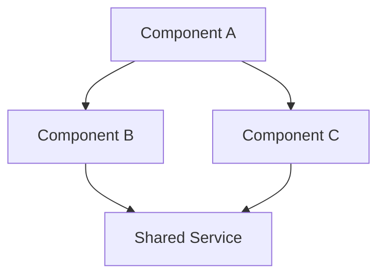
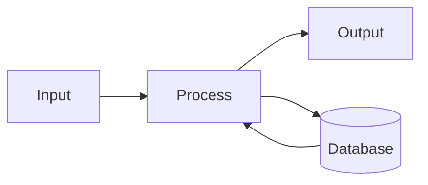

# {Project}

**Problem:** One paragraph on why this project exists and what it's for.

**Current focus:** What phase {phase} is working toward.

**Notes:** Any non-obvious state or constraints worth priming an AI with on session start. Keep this section short.

---

## Architecture

> Auto-loaded into every session. Refresh this section when structure changes significantly (`/simply:commit` will offer when it notices structural changes, or ask Claude to regenerate it directly). Keep it concise and scannable — this is a bootstrap, not exhaustive docs.

### Overview

{One paragraph describing what this system does and its primary purpose}

### Key Concepts

| Concept | Description |
|---------|-------------|
| | |

### Structure

```
{directory tree of key paths only}
```

### Component Graph



### Components

#### {Component Name}

**Purpose**: {What it does}
**Key files**: `path/to/file.ts` — {role}
**Depends on**: {other components}
**Exposes**: {APIs, exports, interfaces}

### Data Flow



### Conventions

- {Naming conventions}
- {File organization rules}
- {Error handling approach}

### External Dependencies

| Dependency | Purpose | Version |
|------------|---------|---------|
| | | |
