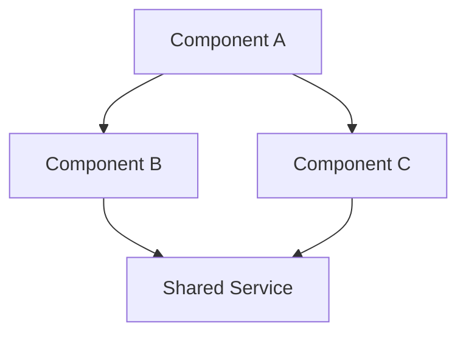
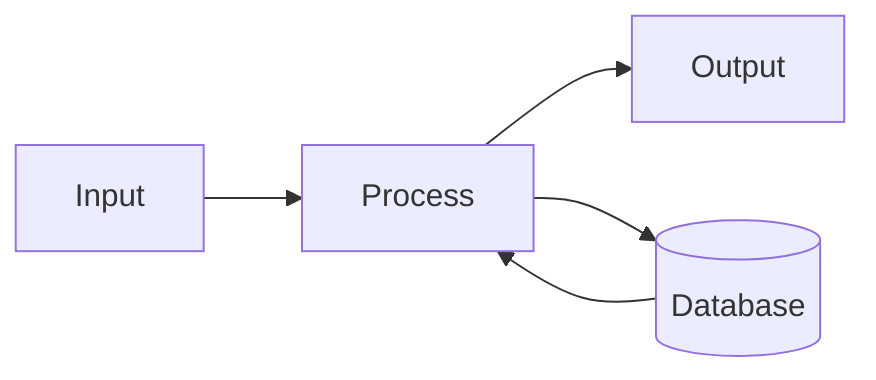

# {Project} Architecture

Last updated: {date}

## Overview

{One paragraph describing what this system does and its primary purpose}

## Key Concepts

| Concept | Description |
|---------|-------------|
| | |

## Structure

```
{directory tree of key paths}
```

## Component Graph



## Components

### {Component Name}

**Purpose**: {What it does}

**Key files**:
- `path/to/file.ts` — {role}

**Depends on**: {other components}

**Exposes**: {APIs, exports, interfaces}

---

## Data Flow



## Patterns

| Pattern | Where Used | Notes |
|---------|------------|-------|
| | | |

## Conventions

- {Naming conventions}
- {File organization rules}
- {Error handling approach}

## External Dependencies

| Dependency | Purpose | Version |
|------------|---------|---------|
| | | |
